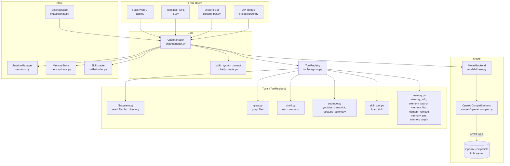

# Gremlin

A local, self-contained Python chat assistant with an agentic tool-calling loop. Gremlin talks to any OpenAI-compatible LLM server (llama.cpp, vLLM, etc.), gives the model a set of sandboxed tools (filesystem, grep, shell, YouTube, memory, skills), and runs a multi-turn loop until the model is satisfied. It ships with four front doors — a Flask web UI, a terminal REPL, a Discord bot, and an OpenAI-compatible API bridge — all sharing the same `ChatManager` core.

## Architecture



## How the agent works

`ChatManager.run()` (in `chat/manager.py`) is the heart of the system. For one user turn it runs a loop, bounded by `AppConfig.MAX_TOOL_ITERATIONS` (20):

1. **Build the system prompt** via `build_system_prompt()` (`chat/prompts.py`). It injects: agent identity, available tool names + descriptions, available skills (name + description), pinned memory entries, current time, and an instruction to distinguish fixable errors from genuine blockers.

2. **Assemble the message list**: system prompt + stored session history (converted by `_stored_to_api()`) + the new user message.

3. **Stream from the model** via `ModelBackend.stream()`. The backend yields normalized `ModelEvent` objects:
   - `thinking` — reasoning delta (if the backend exposes `reasoning_content`)
   - `text` — assistant text delta
   - `tool_call` — a complete tool call (id, name, arguments)
   - `done` — stream finished

4. **Handle each event**:
   - `text` / `thinking` are yielded to the caller as SSE events and accumulated.
   - `tool_call` triggers `ToolRegistry.execute(name, args)`:
     - Arguments are validated against the tool's JSON schema (`validate_args`).
     - The handler runs and returns a string (errors included).
     - The result is appended to the message list as a `tool` role message.
     - The loop continues (the model sees the result and decides what to do next).
   - `done` ends the iteration.

5. **Stop conditions**:
   - The model produces no tool calls (final answer) → `stop_reason: "stop"`.
   - The iteration cap is hit → `stop_reason: "max_iterations"`.
   - A `ModelError` is raised → `stop_reason: "error"`.

6. **Persist**: the assistant's reply (and any tool-call/tool-result pairs) are appended to the session via `SessionManager`.

If the session history grows long, the manager can compact it: it sends the history to the model with `COMPACT_PROMPT` (a summarization instruction) and replaces the old messages with the summary.

## How the LLM is used

Gremlin talks to any OpenAI-compatible `/v1/chat/completions` endpoint. The only backend implementation is `OpenAICompatBackend` (`models/openai_compat.py`):

- **Transport**: `requests.Session`, streaming SSE (`stream: true`).
- **Timeouts**: 10 s connect, 600 s read (local models can be slow to first token).
- **Normalization**: provider-specific fields are absorbed here so callers only see `ModelEvent`:
  - `reasoning_content` → `thinking` events.
  - Fragmented `tool_calls` deltas are accumulated until a complete call is formed.
- **Tool args repair**: streamed tool-call argument JSON is parsed with `json_repair`. Unrecoverable input becomes `{"_raw": ...}` so the registry can ask the model to retry.

The model name and base URL come from `SettingsStore` (persisted in `data/settings.json`), with a fallback to the `GREMLIN_MODEL` environment variable.

## Tools

All tools are registered in `ToolRegistry` (`tools/registry.py`) at startup by `build_registry()` (`tools/__init__.py`). Each tool is a `Tool` dataclass: `name`, `description`, `parameters` (JSON schema), `handler` (a callable taking `dict` and returning `str`).

| Tool | File | What it does |
|---|---|---|
| `read_file` | `tools/filesystem.py` | Read a file from the sandbox root, up to `FS_READ_LIMIT` (128 KB). Paths are sandboxed — anything escaping the root raises `SandboxError`. |
| `edit_file` | `tools/filesystem.py` | Exact-match replacement of a line range in a sandboxed file. |
| `list_directory` | `tools/filesystem.py` | List files/dirs under the sandbox root. |
| `rename_file` / `move_file` | `tools/filesystem.py` | Rename or move a file/directory within the sandbox. |
| `grep_files` | `tools/grep.py` | Regex search across the sandbox. Skips `.git`, `__pycache__`, `node_modules`, `venv`, etc. Caps: 128 KB per file, 300 chars per line, 200 results. |
| `find_files` | `tools/grep.py` | Glob-based filename search across the sandbox. |
| `run_command` | `tools/shell.py` | Run a shell command from the project root. Timeout clamped 1–300 s (default 60). stdout/stderr truncated to 20 000 chars (60/40 head/tail split). Restrictable via the opt-in `shell_allowlist` setting — see *Security*. |
| `web_search` | `tools/web.py` | DuckDuckGo web search (no API key). Results are sanitized before reaching the model. |
| `web_fetch` | `tools/web.py` | Fetch a URL and extract readable text (HTML stripped, sanitized). |
| `youtube_transcript` | `tools/youtube.py` | Fetch a YouTube video's transcript via `yt-dlp` (sanitized). |
| `youtube_video_info` | `tools/youtube.py` | Fetch a YouTube video's title/description/duration via `yt-dlp`. |
| `grav_mcp` | `tools/grav_mcp.py` | Talk to the local Grav CMS via the Grav MCP server (`grav-mcp` Node package). One general-purpose proxy tool: `action` is `list_tools` (discover the ~70 remote tools), `call_tool` (`tool_name` + free-form `arguments`), `list_resources`, or `read_resource`. Spawns/reuses the server over stdio (default) or HTTP; credentials come from `.env` (`GRAV_API_URL`, `GRAV_API_KEY`) and are never logged. See *Skills* (`grav_cms`). |
| `task` | `tools/task.py` | Maintain a per-session task plan (`action`: `plan` to set items, `view` to read them). Persisted under `data/tasks/`. |
| `load_skill` | `tools/skill_tool.py` | Read the full `SKILL.md` instructions for a named skill. The model calls this before doing a job that matches a skill. |
| `memory_add` | `tools/memory.py` | Add a memory entry (content + optional tags + pin flag). |
| `memory_search` | `tools/memory.py` | Substring search across memory content and tags. |
| `memory_get` | `tools/memory.py` | Fetch one memory by id. |
| `memory_remove` | `tools/memory.py` | Delete a memory by id. |
| `memory_pin` | `tools/memory.py` | Pin (`value=true`) or unpin (`value=false`) a memory. Pinned memories are injected into the system prompt every turn. |
| `list_tools` | `tools/meta.py` | List every registered tool with its schema and description. First step of the self-extension flow. |
| `create_skill` | `tools/meta.py` | Write a new `skills/<slug>/SKILL.md` (instructions only). See *Self-extension*. |
| `create_tool` | `tools/meta.py` | Write + register a new executable tool from Python source. See *Self-extension*. |

### Self-extension (meta tools)

Gremlin can extend itself on demand. The bundled `extension_builder` skill
(`skills/extension_builder/SKILL.md`) encodes the workflow:

1. Call `list_tools` to see whether an existing tool already does the job.
2. If the job is a *recombination of existing tools*, call `create_skill` to
   write a new instruction-only `SKILL.md` under `skills/<slug>/`.
3. If the job needs *new computation*, call `create_tool` with a complete
   Python module that defines `build_tool()` (returning a `Tool`). The module
   is written to `data/generated_tools/<name>.py` and registered immediately;
   `load_generated_tools()` re-registers it at the next start, so a created
   tool survives across sessions.

`create_tool` validates the module before persisting (valid identifier,
compiles cleanly, `build_tool()` returns a `Tool`, schema is an object) and
rejects duplicates unless `overwrite` is set. Generated tools run inside the
same sandbox as the built-ins, and the shell allow-list applies to them too.

### Sanitization

External content (e.g. YouTube transcripts) passes through `sanitize_untrusted()` (`tools/sanitize.py`) before reaching the model. It prepends a warning banner, normalizes Unicode (NFKC), translates Cyrillic/Greek homoglyphs to Latin, strips invisible/bidi control characters, and redacts known prompt-injection patterns.

### Security

- **Filesystem sandbox.** Every path the model can touch is resolved against
  the project root; any component that escapes it (`..`, absolute paths,
  symlinks) raises `SandboxError`. This applies to `read_file`, `edit_file`,
  `list_directory`, `rename_file`, `move_file`, `grep_files`, and `find_files`.
- **Shell allow-list (opt-in).** `run_command` executes real shell commands
  from the project root. By default the `shell_allowlist` setting is empty and
  any command is allowed. To restrict it, set `shell_allowlist` (in **Settings**,
  saved to `settings.json`) to a list of program names (e.g.
  `["ls", "cat", "grep", "git"]`); the *base* command of each pipeline segment
  must then be in the list, and anything else is rejected before execution.
  Note this is a convenience guard, not a sandbox — a determined model can
  still chain allowed commands. Treat the project root as trusted.
- **Self-extension sandbox.** Tools created via `create_tool` run inside the
  same sandbox and obey the same shell allow-list as the built-in tools.
  Generated code is persisted to `data/generated_tools/`; delete a file there
  (or pass `overwrite`) to remove or replace it.
- **Untrusted input.** All externally fetched text (web, YouTube) is run
  through `sanitize_untrusted()` (see *Sanitization*) before reaching the model.
## Memory and state

### Sessions (`sessions.py`)

`SessionManager` persists chat history per session as JSON files under `sessions/`. Each session has a UUID, a list of messages (role, content, and for tool calls: name, arguments, result), and a timestamp. The `ChatManager` loads the session's messages before each turn and appends new ones after.

### Memory store (`memory/store.py`)

`MemoryStore` is a JSON-file-backed key-value store (`data/memory.json`). Entries have an `id`, `content`, `tags`, and a `pinned` flag. Pinned entries are injected into the system prompt as a numbered list under `# Pinned memory`. The model can add, search, list, remove, pin, and unpin entries via the memory tools.

### Skills (`skills/`)

Skills are instruction-only resources: `skills/<slug>/SKILL.md` with a small frontmatter block (`name`, `description`). They are never executed; the model reads them via `load_skill` as instructions on how to accomplish a job with the available tools. Bundled skills:

- `extension_builder` — the self-extension workflow: when to make a skill vs. a tool, and how.
- `list_directory` — how to explore a project's file structure.
- `project_explorer` — how to explore and understand a codebase.
- `youtube_transcript` / `youtube_summary` — how to fetch and summarize a YouTube video.
- `code_review`, `debugging`, `git_workflow`, `refactoring`, `testing`, `web_research` — task-specific playbooks.
- `grav_cms` — how to drive the local Grav CMS (pages, media, config, users, packages, system) through the `grav_mcp` tool: discover with `list_tools`, then `call_tool`.

### Settings (`chat/settings.py`)

`SettingsStore` reads/writes `data/settings.json`. Keys: `show_thinking`, `appearance` (light/dark), `theme` (bootswatch slug), `base_url`, `model`, `identity` (persona text), `discord_enabled`, `max_tool_calls` (tool-loop iterations per turn). Context management: `max_context_tokens` (model context window, default 32768), `compaction_threshold` (fraction of the window that triggers auto-compaction, default 0.65), `context_window_turns` (recent turns kept verbatim after compaction, default 10), `tool_result_max_chars` (truncate stored tool results beyond this, default 8000), `chars_per_token` (chars-per-token divisor for the context estimator, default 4). Shell hardening: `shell_allowlist` (list of allowed base programs for `run_command`; empty by default = unrestricted — set it from **Settings** to opt in, or via the `GREMLIN_SHELL_ALLOWLIST` env var for front doors without a settings store). The Discord token is stored separately in `.env` via `python-dotenv`.

## File map

```
gremlin/
├── app.py                  # Flask app factory + JSON/SSE API + static serving
├── cli.py                  # Terminal REPL with ANSI colors
├── discord_bot.py          # Discord bot (discord.py), streams to channel
├── config.py               # AppConfig dataclass, path derivation, defaults
├── utils.py                # Timestamps, atomic file writes
├── sessions.py             # SessionManager: per-session JSON persistence
├── requirements.txt        # Runtime + dev dependencies
├── pyproject.toml          # ruff + mypy config only (NOT a package manifest)
├── .env.example            # GREMLIN_DISCORD_TOKEN
│
├── chat/
│   ├── manager.py          # ChatManager: the model/tool loop
│   ├── prompts.py          # build_system_prompt()
│   └── settings.py         # SettingsStore (data/settings.json)
│
├── models/
│   ├── base.py             # ModelBackend ABC, ModelEvent, ModelError
│   └── openai_compat.py    # OpenAI-compatible SSE streaming backend
│
├── tools/
│   ├── registry.py         # Tool dataclass, ToolRegistry, validate_args, SessionFilter
│   ├── filesystem.py       # read_file, edit_file, list_directory, rename/move_file (sandboxed)
│   ├── grep.py             # grep_files, find_files (sandboxed)
│   ├── shell.py            # run_command (sandboxed, allow-listable)
│   ├── web.py              # web_search, web_fetch (sanitized)
│   ├── youtube.py          # youtube_transcript, youtube_video_info (sanitized)
│   ├── grav_mcp.py         # grav_mcp (Grav CMS via the Grav MCP server; stdio/HTTP)
│   ├── task.py             # task (per-session plan)
│   ├── skill_tool.py       # load_skill
│   ├── memory.py           # memory_add/search/get/remove/pin
│   ├── meta.py             # list_tools, create_skill, create_tool, load_generated_tools
│   └── sanitize.py         # sanitize_untrusted (homoglyphs, injections)
│
├── memory/
│   └── store.py            # MemoryStore: JSON-file-backed CRUD
│
├── skills/
│   ├── loader.py           # SkillLoader: discover + read SKILL.md files
│   ├── extension_builder/SKILL.md   # the self-extension workflow
│   ├── list_directory/SKILL.md
│   ├── youtube_transcript/SKILL.md
│   ├── youtube_summary/SKILL.md
│   └── … 10+ skills total (code_review, debugging, git_workflow, …)
│
├── bridge/
│   └── server.py           # OpenAI-compatible API bridge (raw socket HTTP)
│
├── frontend/
│   ├── templates/index.html
│   ├── static/js/app.js
│   └── static/css/         # app.css, bootstrap.min.css
│
├── files/transcripts/      # Cached YouTube transcripts
├── data/                   # settings.json, memory.json, gremlin.log, tasks/, generated_tools/
├── sessions/               # Per-session JSON files
└── tests/                  # pytest suite
```

## How a typical request flows

1. **User sends a message** (web UI, CLI, Discord, or API bridge).
2. The front door calls `ChatManager.run(session_id, user_message)`.
3. `ChatManager` loads the session from `SessionManager`, builds the system prompt (with tools, skills, pinned memory, identity, time), assembles the message list, and starts the model/tool loop.
4. The model streams tokens. If it calls a tool, `ToolRegistry` validates args, runs the handler, appends the result, and loops.
5. When the model stops calling tools, the final text is persisted to the session and yielded as the last event.
6. The front door serializes events to the client (SSE for web/bridge, direct print for CLI, chunked message edits for Discord).

## Configuration and running

### Prerequisites

- Python 3.12+
- An OpenAI-compatible LLM server running locally (e.g. llama.cpp with `--api-server` on port 8080)

### Install

```bash
python -m venv .venv
source .venv/bin/activate            # Windows: .venv\Scripts\activate
pip install -r requirements.txt
cp .env.example .env                 # optional: then edit .env (Discord token, etc.)
```

### Web UI

```bash
python app.py
# → http://127.0.0.1:7860
```

Configure the model base URL and name in the settings page (persisted to `data/settings.json`).

### CLI

```bash
python cli.py
# /new — fresh session
# /help — show help
# /quit — exit
```

### Discord bot

Set `GREMLIN_DISCORD_TOKEN` in `.env` (or paste it in the settings page), enable "Discord" in settings, then:

```bash
python discord_bot.py
```

### API bridge

Enable the bridge in `AppConfig` (`bridge_enabled=True`, `bridge_key`), then:

```bash
curl -H "Authorization: Bearer <key>" \
     http://127.0.0.1:8787/v1/chat/completions \
     -d '{"model":"any","messages":[{"role":"user","content":"hello"}]}'
```

Supports `stream: true` for SSE. Session continuity via `X-Gremlin-Session` header.

### Environment variables

| Variable | Purpose |
|---|---|
| `GREMLIN_ROOT` | Override project root (defaults to the `config.py` directory) |
| `GREMLIN_MODEL` | Default model name (fallback when settings has none) |
| `GREMLIN_DISCORD_TOKEN` | Discord bot token |
| `GREMLIN_DISCORD_OWNER_ID` | Discord owner user ID |
| `NO_COLOR` | Disable ANSI colors in CLI |

## How to add a tool

1. Create a new file in `tools/`, e.g. `tools/weather.py`.
2. Define a builder function that returns a `Tool`:

```python
from .registry import Tool

def build_weather_tool(cfg) -> Tool:
    def get_weather(args: dict) -> str:
        city = args["city"]
        # ... fetch weather ...
        return f"Weather in {city}: sunny, 72°F"

    return Tool(
        name="get_weather",
        description="Get current weather for a city.",
        parameters={
            "type": "object",
            "properties": {"city": {"type": "string"}},
            "required": ["city"],
        },
        handler=get_weather,
    )
```

3. Register it in `tools/__init__.py` inside `build_registry()`:

```python
from .weather import build_weather_tool
# ...
registry.register(build_weather_tool(cfg))
```

The tool automatically appears in the system prompt and becomes callable by the model.

## How to add a skill

Create a directory under `skills/` with a `SKILL.md` file:

```markdown
---
name: my_skill
description: One-line description shown in the system prompt.
---

Full instructions for the model. Use the available tools (read_file,
grep_files, run_command, etc.) to accomplish the task.
```

The skill is discovered at startup and listed in the system prompt. The model calls `load_skill` to read the full instructions before doing the job.

## Limitations and unfinished parts

- **Single model backend**: only `OpenAICompatBackend` exists. There is no native Anthropic, Gemini, or other provider adapter — they must be accessed through an OpenAI-compatible proxy.
- **No concurrency guard on sessions**: two simultaneous requests to the same session could interleave writes. The Flask app is `threaded=True`, so this is a real risk under load.
- **Shell tool is not a hard sandbox**: `run_command` runs from the project root with a timeout and output truncation, but it is not OS-level isolation. A malicious or buggy model command can read or write anything the user's OS account can.
- **Memory search is substring-only**: no embeddings, no fuzzy matching. `MemoryStore.search` does a case-insensitive substring scan.
- **Session compaction is lossy**: the compact prompt asks the model to summarize, but details can be lost. There is no mechanism to verify the summary's fidelity.
- **No multi-user support**: the app is designed for a single local user. The Discord bot has an owner check, but the web UI and bridge have no authentication (the bridge requires a bearer key, but the web UI does not).
- **Bridge is raw-socket HTTP**: the bridge server (`bridge/server.py`) implements HTTP parsing by hand (no framework). It is simple and dependency-free but has less battle-tested edge-case handling than a real HTTP library.
- **Frontend is minimal**: the web UI is a single-page app with Bootstrap theming. There is no session management UI beyond "new session", no tool-call visualization beyond a simple list, and no file upload.
