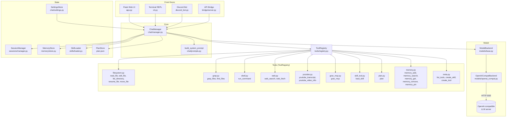

# Gremlin

A local, self-contained Python chat assistant with an agentic tool-calling loop. Gremlin talks to any OpenAI-compatible LLM server (llama.cpp, vLLM, etc.), gives the model a set of sandboxed tools (filesystem, grep, shell, web, YouTube, memory, skills, Grav CMS) and runs a multi-turn loop until the model is satisfied. The model can even extend itself: it can author new instruction-only skills and new executable Python tools on demand. It ships with four front doors — a Flask web UI, a terminal REPL, a Discord bot, and an OpenAI-compatible API bridge — all sharing the same `ChatManager` core.

## Architecture



## How the agent works

`ChatManager.run()` (in `chat/manager.py`) is the heart of the system. For one user turn it runs a loop, bounded by the `max_tool_calls` setting (default 20):

1. **Build the system prompt** via `build_system_prompt()` (`chat/prompts.py`). It injects: working-style instructions (make progress in small verifiable steps, verify after changes, distinguish recoverable errors from genuine blockers), a planning playbook (create/execute/checkpoint/revise plans for substantial work), available skills (name + description), available tool names + descriptions, the current plan summary while a plan exists, agent identity, pinned memory entries, and the current time.

2. **Assemble the message list**: `ChatManager._build_api_messages()` builds a bounded list (system prompt always; the latest compression summary replaces older history; the most recent `context_window_turns` turns verbatim, oldest dropped first until the token budget fits) ending with the new user message.

3. **Stream from the model** via `ModelBackend.stream()`. The backend yields normalized `ModelEvent` objects:
   - `thinking` — reasoning delta (if the backend exposes `reasoning_content`)
   - `text` — assistant text delta
   - `tool_call` — a complete tool call (id, name, arguments)
   - `done` — stream finished

4. **Handle each event**:
   - `text` / `thinking` are yielded to the caller as SSE events and accumulated.
   - `tool_call` triggers `ToolRegistry.execute(name, args)`:
     - Arguments are validated against the tool's JSON schema (`validate_args`).
     - The handler runs and returns a string (errors included).
     - The result is appended to the message list as a `tool` role message.
     - The loop continues (the model sees the result and decides what to do next).
   - `done` ends the iteration.

5. **Stop conditions**:
   - The model produces no tool calls (final answer) → `stop_reason: "completed"`.
   - The iteration cap is hit → `stop_reason: "max_iterations"`.
   - A `ModelError` is raised → `stop_reason: "model_error"`.

6. **Persist**: the assistant's reply (and any tool-call/tool-result pairs, plus a per-message timeline) are appended to the session via `SessionManager`, and a `done` event (with `stop_reason`) closes the stream.

7. **Context management**: before building the message list, `_maybe_compact()` checks whether the session would exceed its budget (last reported prompt tokens, or a chars-per-token estimate, against `max_context_tokens` × `compaction_threshold`). If so, `compress()` asks the model to summarize everything since the last compression summary (input capped at half the context window) and stores it as a marker message; `_build_api_messages()` then sends system prompt + that summary + the most recent `context_window_turns` turns verbatim, dropping oldest turns until the token budget fits. Tool results are truncated to `tool_result_max_chars` when sent to the model (full results stay in the session file).

8. **Interrupting a turn**: the backend allows one active generation per session. The composer's **Stop** button (visible while a turn runs) calls `POST /api/sessions/<id>/abort`, which sets a cancel flag the loop checks at every checkpoint — the in-flight stream is closed at the next event, any tool in flight finishes but its result is discarded, and no partial assistant reply is saved (the user message stays in history). Sending a new message while a turn is still streaming does the same automatically: the older turn is superseded and stops at its next event while the new one takes over. Both paths are cooperative (no hard process kill), so the session file is never left half-written.

## How the LLM is used

Gremlin talks to any OpenAI-compatible `/v1/chat/completions` endpoint. The only backend implementation is `OpenAICompatBackend` (`models/openai_compat.py`):

- **Transport**: `requests.Session`, streaming SSE (`stream: true`).
- **Timeouts**: 10 s connect, 600 s read (local models can be slow to first token).
- **Normalization**: provider-specific fields are absorbed here so callers only see `ModelEvent`:
  - `reasoning_content` → `thinking` events.
  - Fragmented `tool_calls` deltas are accumulated until a complete call is formed.
- **Tool args repair**: streamed tool-call argument JSON is parsed with `json_repair`. Unrecoverable input becomes `{"_raw": ...}` so the registry can ask the model to retry.

The model name and base URL come from `SettingsStore` (persisted in `data/settings.json`), with a fallback to the `GREMLIN_MODEL` environment variable.

## Tools

All tools are registered in `ToolRegistry` (`tools/registry.py`) at startup by `build_registry()` (`tools/__init__.py`). Each tool is a `Tool` dataclass: `name`, `description`, `parameters` (JSON schema), `handler` (a callable taking `dict` and returning `str`).

| Tool | File | What it does |
|---|---|---|
| `read_file` | `tools/filesystem.py` | Read a file from the sandbox root, up to `FS_READ_LIMIT` (128 KB). Paths are sandboxed — anything escaping the root raises `SandboxError`. |
| `edit_file` | `tools/filesystem.py` | Exact-match replacement of a line range in a sandboxed file. |
| `list_directory` | `tools/filesystem.py` | List files/dirs under the sandbox root. |
| `rename_file` / `move_file` | `tools/filesystem.py` | Rename or move a file/directory within the sandbox. |
| `grep_files` | `tools/grep.py` | Regex search across the sandbox. Skips `.git`, `__pycache__`, `node_modules`, `venv`, etc. Caps: 128 KB per file, 300 chars per line, 200 results. |
| `find_files` | `tools/grep.py` | Glob-based filename search across the sandbox. |
| `run_command` | `tools/shell.py` | Run a shell command from the project root. Timeout clamped 1–300 s (default 60). stdout/stderr truncated to 20 000 chars (60/40 head/tail split). Restrictable via the opt-in `shell_allowlist` setting — see *Security*. |
| `web_search` | `tools/web.py` | DuckDuckGo web search (no API key). Results are sanitized before reaching the model. |
| `web_fetch` | `tools/web.py` | Fetch a URL and extract readable text (HTML stripped, sanitized). |
| `youtube_transcript` | `tools/youtube.py` | Fetch a YouTube video's English transcript via `yt-dlp` (manual subtitles preferred, auto captions otherwise). Saved under `files/transcripts/<channel>/<video name>.txt`; up to 24 KB returned to the model (sanitized). |
| `youtube_video_info` | `tools/youtube.py` | Fetch a YouTube video's title, uploader, duration, view count and description via `yt-dlp` (sanitized). |
| `grav_mcp` | `tools/grav_mcp.py` | Talk to the local Grav CMS via the Grav MCP server (`grav-mcp` Node package). One general-purpose proxy tool: `action` is `list_tools` (brief index of the remote tools), `describe_tool` (one tool's full parameter schema), `call_tool` (`tool_name` + free-form `arguments`), `list_resources`, or `read_resource` (`uri`). Large-payload escape hatches: `arguments_file` (read arguments from a JSON file) and `result_to_file` (write the full untruncated result to a file). Spawns/reuses the server over stdio (default, `npx -y grav-mcp`) or HTTP (`GRAV_MCP_TRANSPORT`); credentials come from `.env` (`GRAV_API_URL`, `GRAV_API_KEY`) and are never logged. See *Skills* (`grav_cms`). |
| `plan` | `tools/plan.py`, `planning/store.py` | Persistent planning for substantial coding / self-refactoring: `create` a plan (goal, phases, tasks, dependencies) after inspecting the code, execute incrementally (`start`, `progress`, `test`, `done`, `skip`, `block`, `reset`), `revise` when results invalidate it, `checkpoint` git before self-modifying changes, `render` a human-readable `plan.md`, `finish`/`abandon`. Authoritative state in `plan.json` at the project root; a compact summary is injected into the system prompt every turn, so it survives compaction and restarts. |
| `load_skill` | `tools/skill_tool.py` | Read the full `SKILL.md` instructions for a named skill. The model calls this before doing a job that matches a skill. |
| `memory_add` | `tools/memory.py` | Add a memory entry (content + optional tags + pin flag). |
| `memory_search` | `tools/memory.py` | Substring search across memory content and tags. |
| `memory_get` | `tools/memory.py` | Fetch one memory by id. |
| `memory_remove` | `tools/memory.py` | Delete a memory by id. |
| `memory_pin` | `tools/memory.py` | Pin (`value=true`) or unpin (`value=false`) a memory. Pinned memories are injected into the system prompt every turn. |
| `list_tools` | `tools/meta.py` | List every registered tool with its schema and description. First step of the self-extension flow. |
| `create_skill` | `tools/meta.py` | Write a new `skills/<slug>/SKILL.md` (instructions only). See *Self-extension*. |
| `create_tool` | `tools/meta.py` | Write + register a new executable tool from Python source. See *Self-extension*. |

### Self-extension (meta tools)

Gremlin can extend itself on demand. The bundled `extension_builder` skill
(`skills/extension_builder/SKILL.md`) encodes the workflow:

1. Call `list_tools` to see whether an existing tool already does the job.
2. If the job is a *recombination of existing tools*, call `create_skill` to
   write a new instruction-only `SKILL.md` under `skills/<slug>/`.
3. If the job needs *new computation*, call `create_tool` with a complete
   Python module that defines `build_tool()` (returning a `Tool`). The module
   is written to `data/generated_tools/<name>.py` and registered immediately;
   `load_generated_tools()` re-registers it at the next start, so a created
   tool survives across sessions.

`create_tool` validates the module before persisting (valid identifier,
compiles cleanly, `build_tool()` returns a `Tool`, schema is an object) and
rejects duplicates unless `overwrite` is set. Generated tools run inside the
same sandbox as the built-ins, and the shell allow-list applies to them too.

### Sanitization

External content (e.g. YouTube transcripts) passes through `sanitize_untrusted()` (`tools/sanitize.py`) before reaching the model. It prepends a warning banner, normalizes Unicode (NFKC), translates Cyrillic/Greek homoglyphs to Latin, strips invisible/bidi control characters, and redacts known prompt-injection patterns.

### Security

- **Filesystem sandbox.** Every path the model can touch is resolved against
  the project root; any component that escapes it (`..`, absolute paths,
  symlinks) raises `SandboxError`. This applies to `read_file`, `edit_file`,
  `list_directory`, `rename_file`, `move_file`, `grep_files`, and `find_files`.
- **Shell allow-list (opt-in).** `run_command` executes real shell commands
  from the project root. By default the `shell_allowlist` setting is empty and
  any command is allowed. To restrict it, set `shell_allowlist` (in **Settings**,
  saved to `settings.json`) to a list of program names (e.g.
  `["ls", "cat", "grep", "git"]`); the *base* command of each pipeline segment
  must then be in the list, and anything else is rejected before execution.
  Note this is a convenience guard, not a sandbox — a determined model can
  still chain allowed commands. Treat the project root as trusted.
- **Self-extension sandbox.** Tools created via `create_tool` run inside the
  same sandbox and obey the same shell allow-list as the built-in tools.
  Generated code is persisted to `data/generated_tools/`; delete a file there
  (or pass `overwrite`) to remove or replace it.
- **Untrusted input.** All externally fetched text (web, YouTube) is run
  through `sanitize_untrusted()` (see *Sanitization*) before reaching the model.
## Memory and state

### Sessions (`sessions/` package)

`SessionManager` (in the `sessions/` package) persists chat history per session as JSON files under `sessions/`. Each session has a UUID, a title, a list of messages (role, content, and for assistant turns: tool calls with name, arguments, result, status, plus a timeline), and timestamps. The last successful model call's token usage is recorded on the session (`last_usage`) and cleared after compaction, so the auto-compact decision can use real provider numbers. Writes go through the shared atomic writer (temp file + `os.replace` under an exclusive lock). The `ChatManager` loads the session's messages before each turn and appends new ones after.

### Memory store (`memory/store.py`)

`MemoryStore` is a JSON-file-backed key-value store (`data/memory.json`). Entries have an `id`, `content`, `tags`, and a `pinned` flag. Pinned entries are injected into the system prompt as a numbered list under `# Pinned memory`. The model can add, search, fetch by id, remove, and pin/unpin entries via the memory tools.
### Planning (`planning/store.py`)

`PlanStore` backs the `plan` tool. The plan is a dataclass tree (goal, status, revision, notes, phases → tasks with id, title, status, progress, `depends_on`, notes, last test result) persisted as JSON at `plan.json` in the project root — the single source of truth, written with the shared atomic writer on every mutation and re-read on every operation, so there is no in-memory copy to drift or lose to compaction/restart. Statuses: tasks are `pending` / `in_progress` / `done` / `blocked` / `skipped` (guarded transitions; starting a task requires its dependencies to be `done` or `skipped`), the plan is `active` / `completed` / `abandoned`. `revise` bumps the revision, records the reason in the notes, optionally replaces the goal/structure, and revives finished plans. `checkpoint` commits the working tree with `git` ("gremlin checkpoint: …"), records the commit hash in the plan, and on a clean tree records the current `HEAD` without a new commit — self-modifying work can always be reverted to a recorded checkpoint. `render` writes the human-readable `plan.md` view. A compact summary (goal, status, progress, one line per task) is injected into the system prompt as `# Current plan` on every turn while a plan exists.

### Skills (`skills/`)

Skills are instruction-only resources: `skills/<slug>/SKILL.md` with a small frontmatter block (`name`, `description`). They are never executed; the model reads them via `load_skill` as instructions on how to accomplish a job with the available tools. Bundled skills:

- `extension_builder` — the self-extension workflow: when to make a skill vs. a tool, and how.
- `list_directory` — how to explore a project's file structure.
- `project_explorer` — how to explore and understand a codebase.
- `youtube_transcript` / `youtube_summary` — how to fetch and summarize a YouTube video.
- `code_review`, `debugging`, `git_workflow`, `refactoring`, `testing`, `web_research` — task-specific playbooks.
- `grav_cms` — how to drive the local Grav CMS (pages, media, config, users, packages, system) through the `grav_mcp` tool: discover with `list_tools`, then `call_tool`.

### Settings (`chat/settings.py`)

`SettingsStore` reads/writes `data/settings.json`. Keys: `show_thinking`, `appearance` (light/dark), `theme` (bootswatch slug), `base_url`, `model`, `identity` (persona text), `discord_enabled`, `max_tool_calls` (tool-loop iterations per turn). Context management: `max_context_tokens` (model context window, default 32768), `compaction_threshold` (fraction of the window that triggers auto-compaction, default 0.65), `context_window_turns` (recent turns kept verbatim after compaction, default 10), `tool_result_max_chars` (truncate stored tool results beyond this, default 8000), `chars_per_token` (chars-per-token divisor for the context estimator, default 4). Shell hardening: `shell_allowlist` (list of allowed base programs for `run_command`; empty by default = unrestricted — set it from **Settings** to opt in, or via the `GREMLIN_SHELL_ALLOWLIST` env var for front doors without a settings store). The Discord token is stored separately in `.env` via `python-dotenv`.

## File map

```
gremlin/
├── app.py                  # Flask app factory + JSON/SSE API + static serving
├── cli.py                  # Terminal REPL with ANSI colors
├── discord_bot.py          # Discord bot (discord.py), streams to channel
├── config.py               # AppConfig dataclass, path derivation, defaults
├── utils.py                # Timestamps, atomic file writes, file locks
├── sessions/               # SessionManager: per-session JSON persistence (manager.py)
├── requirements.txt        # Runtime + dev dependencies
├── pyproject.toml          # Package manifest (deps, console scripts) + ruff/mypy config
├── .env.example            # Discord token, Grav MCP credentials
├── plan.json               # Authoritative plan state (planning tool) — created when the model plans work
├── plan.md                 # Human-readable plan view (optional; `plan render`)
│
├── chat/
│   ├── manager.py          # ChatManager: the model/tool loop
│   ├── prompts.py          # build_system_prompt()
│   └── settings.py         # SettingsStore (data/settings.json)
│
├── models/
│   ├── base.py             # ModelBackend ABC, ModelEvent, ModelError
│   └── openai_compat.py    # OpenAI-compatible SSE streaming backend
│
├── tools/
│   ├── __init__.py         # build_registry(): wires every tool set
│   ├── registry.py         # Tool dataclass, ToolRegistry, validate_args, SessionFilter
│   ├── filesystem.py       # read_file, edit_file, list_directory, rename/move_file (sandboxed)
│   ├── grep.py             # grep_files, find_files (sandboxed)
│   ├── shell.py            # run_command (sandboxed, allow-listable)
│   ├── web.py              # web_search, web_fetch (sanitized)
│   ├── youtube.py          # youtube_transcript, youtube_video_info (sanitized)
│   ├── grav_mcp.py         # grav_mcp (Grav CMS via the Grav MCP server; stdio/HTTP)
│   ├── task.py             # defined but NOT registered (see Limitations)
│   ├── plan.py             # plan (persistent plan.json state machine)
│   ├── memory.py           # memory_add/search/get/remove/pin
│   ├── meta.py             # list_tools, create_skill, create_tool, load_generated_tools
│   └── sanitize.py         # sanitize_untrusted (homoglyphs, injections)
│
├── memory/
│   └── store.py            # MemoryStore: JSON-file-backed CRUD
│
├── planning/
│   └── store.py            # Plan/Phase/Task dataclasses, PlanStore: plan.json persistence, transitions, checkpoints
│
├── skills/
│   ├── loader.py           # SkillLoader: discover + read SKILL.md files
│   ├── extension_builder/SKILL.md   # the self-extension workflow
│   ├── list_directory/SKILL.md
│   ├── youtube_transcript/SKILL.md
│   ├── youtube_summary/SKILL.md
│   └── … 13 skills total (code_review, debugging, git_workflow, …)
│
├── bridge/
│   └── server.py           # OpenAI-compatible API bridge (raw socket HTTP)
│
├── tts/
│   ├── piper_tts.py        # Piper TTS engine: multi-voice, lazy-loaded, streams raw PCM
│   ├── sanitize.py         # markdown -> plain prose before synthesis
│   └── download.py         # python -m tts.download: fetch voice files (skips existing)
│
├── frontend/
│   ├── templates/index.html
│   ├── static/js/app.js
│   ├── static/js/tts.js    # sentence stream buffer + Web Audio playback
│   └── static/css/         # app.css, bootstrap.min.css
│
├── files/transcripts/      # Cached YouTube transcripts (also files/videos/ for media)
├── data/                   # settings.json, memory.json, gremlin.log, tasks/, generated_tools/
├── sessions/               # Per-session JSON files
└── tests/                  # pytest suite
```

## How a typical request flows

1. **User sends a message** (web UI, CLI, Discord, or API bridge).
2. The front door calls `ChatManager.run(session_id, user_message, settings)`.
3. The user message is persisted, then auto-compaction runs if the session is over budget (see *How the agent works*). `ChatManager` builds the system prompt (working style, planning playbook, tools, skills, current plan, identity, pinned memory, time) and assembles the bounded message list (system + compression summary + recent turns).
4. The model streams tokens. If it calls a tool, `ToolRegistry` validates args, runs the handler, appends the result, and loops.
5. When the model stops calling tools (or a stop condition fires), the final assistant message is persisted to the session.
6. `run()` yields a small event stream: `thinking`, `text`, `tool_call` (with result + status), `usage` (when the provider reports tokens), `error`, and finally `done` (with `stop_reason`).
7. The front door serializes events to the client (SSE for web/bridge, direct print for CLI, chunked message edits for Discord).

## Configuration and running

### Prerequisites

- Python 3.10+ (3.12 recommended; `requires-python = ">=3.10"`)
- An OpenAI-compatible LLM server running locally (e.g. llama.cpp with `--api-server` on port 8080)

### Install

```bash
python -m venv .venv
source .venv/bin/activate            # Windows: .venv\Scripts\activate
pip install -r requirements.txt
cp .env.example .env                 # optional: then edit .env (Discord token, etc.)
```

### Web UI

```bash
python app.py
# → http://127.0.0.1:7860   (override: GREMLIN_HOST, GREMLIN_PORT)
```

Configure the model base URL and name in the settings page (persisted to `data/settings.json`). The sidebar supports rename, manual history compression, and delete per session.

### CLI

```bash
python cli.py
# /new — fresh session
# /help — show help
# /quit — exit
```

### Discord bot

Set `GREMLIN_DISCORD_TOKEN` in `.env` (or paste it in the settings page; it is written to `.env` on save) and set `GREMLIN_DISCORD_OWNER_ID` to your user id (only the owner can trigger Gremlin), then:

```bash
python discord_bot.py
```

Each Discord channel maps to its own session (`data/discord_sessions.json`); `/new` in a channel starts a fresh one. Replies stream into the channel as throttled message edits.

### Piper TTS (voice)

Optional: speak assistant replies aloud with a local Piper voice. Speech is synthesized on this machine and streamed to the browser as raw PCM — no WAV files are written to disk and nothing is cached in the browser. The voice catalog lives in `tts.VOICES` (Alba `en_GB-alba-medium` is the default); the settings dropdown lists every catalog voice, with voices whose model files are missing marked "(files missing)" (selecting one still works — the TTS endpoint returns `503` until the files are downloaded).

1. Install the engine (already in `requirements.txt`): `pip install piper-tts`.

2. Download the voice files into `models/piper/` (`.onnx` binaries are git-ignored); skips files that already exist:

   ```bash
   python -m tts.download                 # every voice in the catalog
   python -m tts.download en_US-amy-medium   # or a single one
   ```

3. In the web UI, enable **Piper TTS** on the settings page, pick a **Voice**, and save (`piper_voice` in `data/settings.json`). Sentences start speaking as soon as they complete, while the rest of the reply is still streaming. Replies are passed through `tts.sanitize_for_speech` first, so markdown (links, code fences, lists, …) becomes plain prose before synthesis; if a message contains only markdown syntax, nothing is spoken and no voice is loaded. If the selected voice's files are missing, the TTS endpoint logs a warning and returns `503`; chat still works normally.

**Interrupting mid-speech**: sending a new message while a reply is still streaming (or TTS is playing) aborts the in-flight stream, hard-stops the audio (queue, scheduled buffers, and any synthesis request still in flight), and marks the old bubble `interrupted`. The backend allows one active generation per session: the superseded turn stops at its next event, its partial assistant reply is not saved, and the interrupted user message stays in history as context for the new turn.

**Manual verification** (once set up):

- Toggle off → replies are silent.
- Toggle on with the model present → the first sentence is spoken while the rest of the reply is still streaming.
- Switch voice in settings → the new voice speaks the next sentence.
- Get a reply containing **bold** or other markdown emphasis → you hear the words only, never "asterisk asterisk" (leftover `**` from a split emphasis is dropped).
- Send a new message mid-reply → the previous audio stops immediately, the old bubble is marked `interrupted`, and the new turn streams cleanly.
- Tap **Stop** mid-reply → the stream and any in-flight TTS stop, no new message is sent, the bubble is marked `interrupted`, and you can type freely.
- If the voice files are missing, chat still works and the server log records a clear warning while the TTS endpoint returns `503`.
### API bridge

Enable the bridge in `AppConfig` (`bridge_enabled=True`, `bridge_key`) or via environment (`GREMLIN_BRIDGE=1`, optional `GREMLIN_BRIDGE_KEY`), then:

```bash
curl -H "Authorization: Bearer <key>" \
     http://127.0.0.1:8787/v1/chat/completions \
     -d '{"model":"any","messages":[{"role":"user","content":"hello"}]}'
```

Supports `stream: true` for SSE. Session continuity via `X-Gremlin-Session` header.

### Environment variables

| Variable | Purpose |
|---|---|
| `GREMLIN_ROOT` | Override project root (defaults to the `config.py` directory) |
| `GREMLIN_MODEL` | Default model name (fallback when settings has none) |
| `GREMLIN_HOST` / `GREMLIN_PORT` | Web UI bind address (default `127.0.0.1:7860`) |
| `GREMLIN_BRIDGE` / `GREMLIN_BRIDGE_KEY` | Enable the API bridge (`1`) / its bearer key |
| `GREMLIN_SHELL_ALLOWLIST` | Comma-separated program allow-list for `run_command` (fallback when no settings store) |
| `GREMLIN_DISCORD_TOKEN` | Discord bot token |
| `GREMLIN_DISCORD_OWNER_ID` | Discord owner user ID |
| `GRAV_API_URL` / `GRAV_API_KEY` | Grav CMS credentials for the `grav_mcp` tool (never logged) |
| `GRAV_MCP_TRANSPORT` / `GRAV_MCP_HTTP_URL` | Grav MCP transport (`stdio` default / `http`) and endpoint |
| `NO_COLOR` | Disable ANSI colors in CLI |

## How to add a tool

1. Create a new file in `tools/`, e.g. `tools/weather.py`.
2. Define a builder function that returns a `Tool`:

```python
from .registry import Tool

def build_weather_tool(cfg) -> Tool:
    def get_weather(args: dict) -> str:
        city = args["city"]
        # ... fetch weather ...
        return f"Weather in {city}: sunny, 72°F"

    return Tool(
        name="get_weather",
        description="Get current weather for a city.",
        parameters={
            "type": "object",
            "properties": {"city": {"type": "string"}},
            "required": ["city"],
        },
        handler=get_weather,
    )
```

3. Register it in `tools/__init__.py` inside `build_registry()`:

```python
from .weather import build_weather_tool
# ...
registry.register(build_weather_tool(cfg))
```

The tool automatically appears in the system prompt and becomes callable by the model.

## How to add a skill

Create a directory under `skills/` with a `SKILL.md` file:

```markdown
---
name: my_skill
description: One-line description shown in the system prompt.
---

Full instructions for the model. Use the available tools (read_file,
grep_files, run_command, etc.) to accomplish the task.
```

The skill is discovered at startup and listed in the system prompt. The model calls `load_skill` to read the full instructions before doing the job.

## Limitations and unfinished parts

- **Single model backend**: only `OpenAICompatBackend` exists. There is no native Anthropic, Gemini, or other provider adapter — they must be accessed through an OpenAI-compatible proxy.
- **Writes are atomic, not serialized end-to-end**: every store (sessions, memory, settings, plan, tasks) writes via temp file + `os.replace` under an exclusive lock, so no reader ever sees a partial file. But a full read-modify-write cycle is not locked, so two simultaneous turns on the same session could still interleave (last write wins). The Flask app is `threaded=True`, so this is a real risk under load.
- **Shell tool is not a hard sandbox**: `run_command` runs from the project root with a timeout and output truncation, but it is not OS-level isolation. A malicious or buggy model command can read or write anything the user's OS account can.
- **Memory search is substring-only**: no embeddings, no fuzzy matching. `MemoryStore.search` does a case-insensitive substring scan.
- **Session compaction is lossy**: the compact prompt asks the model to summarize, but details can be lost. There is no mechanism to verify the summary's fidelity.
- **No multi-user support**: the app is designed for a single local user. The Discord bot has an owner check, but the web UI and bridge have no authentication (the bridge requires a bearer key, but the web UI does not).
- **`task` tool is defined but not wired**: `tools/task.py` defines a per-session task-plan tool, but `build_registry()` never registers it — it is not available to the model (the `plan` tool covers this workflow today).
- **Bridge is raw-socket HTTP**: the bridge server (`bridge/server.py`) implements HTTP parsing by hand (no framework). It is simple and dependency-free but has less battle-tested edge-case handling than a real HTTP library.
- **Frontend is minimal**: the web UI is a single-page app with Bootstrap theming. It supports new/rename/delete/compress per session and shows tool calls as a simple list, but there is no file upload, no token-usage dashboard, and no mobile layout.
